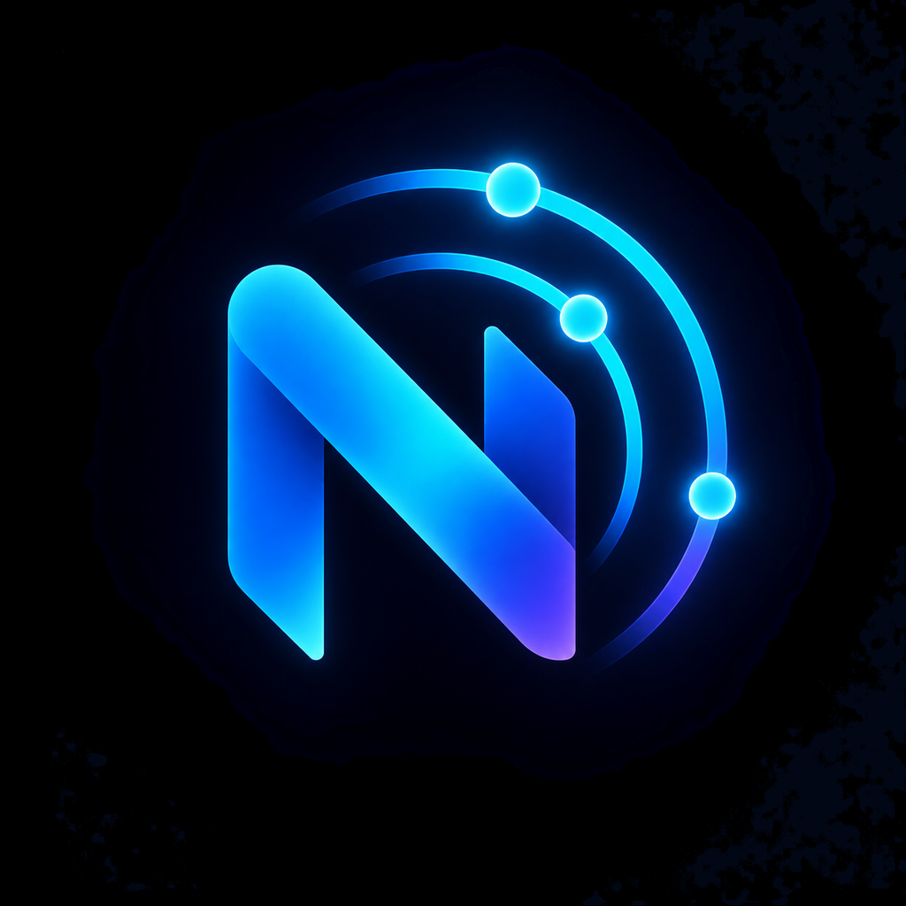

# NetScope

  

**Apple-native network diagnostics and learning toolkit for iPhone.**

NetScope is a SwiftUI app for inspecting devices and common services on networks you own or are authorized to test. It combines local-network discovery, port checks, diagnostics, Bonjour discovery, SSH/iSH workflows, and an educational toolbox in one iOS app.

## Highlights

- private IPv4 /24 discovery with multiple scan profiles
- TCP service and port inspection without remote login
- Bonjour discovery for services such as AirPlay, SSH, HTTP, HomeKit and Matter
- DNS, TCP latency and selected-port diagnostics
- local scan history and device/service summaries
- iSH workflows for Nmap-based inspection on iPhone
- educational Nmap/Nuclei command builders and learning material
- results stored locally on the device

## Stack

`Swift` · `SwiftUI` · `Network.framework` · `Bonjour` · `XCTest` · `iOS 17+` · `iSH` · `Nmap`

## Run locally

1. Open `NetScope.xcodeproj` in Xcode.
2. Select your own Apple Development Team.
3. Run on a physical iPhone for reliable Local Network behavior.
4. Allow Local Network access when requested.

The optional public-IP lookup is only performed after the user explicitly requests it.

## Security scope

NetScope is designed for defensive diagnostics and learning. Local discovery is limited to private/link-local IPv4 ranges. Use port and network checks only on systems you own or have explicit permission to test.

The app does not provide exploit execution, credential attacks, or automatic remote command execution.

## Project status

Active development. The repository is published as a portfolio/source-available project and can evolve independently from future App Store releases.

## License

Copyright © 2026 Krystian. All rights reserved.

The source is publicly visible for portfolio and review purposes. No permission is granted to copy, modify, redistribute, sublicense, or use it commercially except where required by GitHub's platform terms. See [LICENSE](LICENSE).
